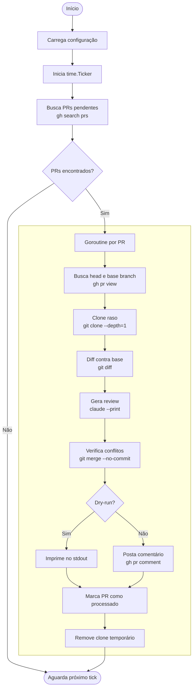

# watson

[Arquitetura](docs/architecture.md) · [Configuração](docs/configuration.md) · [Desenvolvimento](docs/development.md)

---

Daemon em Go que automatiza code reviews de pull requests no GitHub usando o Claude Code como engine de análise.

A cada intervalo configurável, o programa detecta PRs onde você é reviewer, analisa o diff com IA e posta o review diretamente como comentário no PR — sem intervenção manual.

**O programa nunca faz push, merge ou aprovação. A única escrita no GitHub é o comentário de review.**

---

## Como funciona



---

## Pré-requisitos

- **Go 1.21+**
- **[GitHub CLI](https://cli.github.com/)** autenticado (`gh auth login`)
- **[Claude Code CLI](https://claude.ai/code)** instalado e autenticado

---

## Instalação

```bash
git clone https://github.com/meopedevts/watson
cd watson
go build -o watson ./cmd/
```

---

## Uso

```bash
# Produção — posta comentários nos PRs
GITHUB_REVIEWER_USERNAME=seu-usuario ./watson

# Dry-run — imprime reviews no stdout, sem escrever no GitHub
GITHUB_REVIEWER_USERNAME=seu-usuario ./watson --dry-run

# Poll a cada 5 minutos
GITHUB_REVIEWER_USERNAME=seu-usuario POLL_INTERVAL_MINUTES=5 ./watson
```

Pressione `Ctrl+C` para encerrar o daemon graciosamente.

---

## Configuração

| Variável | Obrigatória | Padrão | Descrição |
|----------|:-----------:|--------|-----------|
| `GITHUB_REVIEWER_USERNAME` | Sim | — | Seu usuário GitHub |
| `POLL_INTERVAL_MINUTES` | Não | `15` | Intervalo de polling em minutos |
| `CLAUDE_MODEL` | Não | `claude-sonnet-4-20250514` | Modelo Claude utilizado |
| `REPO_BASE_DIR` | Não | `/tmp/watson` | Diretório para clones temporários |
| `GIT_SSH_HOST` | Não | — | Alias SSH para autenticação customizada |

> Para autenticação via SSH com configuração customizada, veja [`docs/configuration.md`](docs/configuration.md).

---

## Tasks

```bash
task build          # Compila o binário
task run            # Executa em produção
task dry-run        # Executa sem postar no GitHub
task dev            # Dry-run com poll de 1 minuto
task test           # Roda os testes
task check          # vet + testes
task clean          # Remove binário e artefatos
```

---

## Documentação

| Documento | Conteúdo |
|-----------|----------|
| [`docs/architecture.md`](docs/architecture.md) | Estrutura de pacotes, decisões técnicas, fluxo interno |
| [`docs/configuration.md`](docs/configuration.md) | Referência completa de configuração e autenticação |
| [`docs/development.md`](docs/development.md) | Build, testes, cobertura e convenções |
